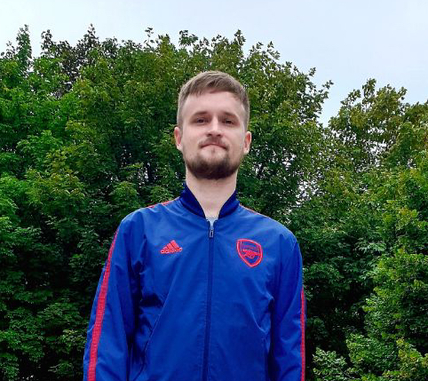

# **Pavel Titov** #



---

## **Contacts** ##
**Location:** Minsk, Belarus\
**Phone:** +375 29 348-62-01\
**Email:** pashoktitov16@gmail.com\
**GitHub:** PavelTitov16\
**Discord:** Pavluzont #5919

---

## **My Summary** ##
I'm disciplined and executive professional engineer with 7+ years of experience in the design of power supply and electrical equipment for mining chemical industry. My job is developing projects of mine electrical substations, supply and distribution networks of mines, salt dumps, surface and underground complexes with specifications in full graphic and text materials. 

Frontend Developing is a new call for realizing my strong ability to adapt to new environment and challenges. I want to take part in new activities with my persistence in bringing the work started to the end with high ability of team playing - want to feel myself needed in using my English.

I'm Father of Corgi.   

---

## **Skills** ##
* HTML
* CSS
* JavaScript 
* Git
* VS Code 
* Figma
* DevTools
* Photoshop
* Netlify
* jQuery  
* React

---

## **Code Example** ##

**Kata from Codewars:**
Typically, reversing an array is a pretty straightforward task even for novice programmers. But not when a crowd of angry zombies scratching your door, looking for a fresh brains. In this case even skilled ninja-geek probably prefer to quickly push his code on github to have enough time to find a chainsaw. So there's **two** obstacles:
1. Your code needs to be as short as possible, in fact not longer than 28 characters
2. Because you are scared and stressed you have forgotten how to use the standard reverse() method
```javascript
weirdReverse=a=>a.sort(a=>1)
```
---

## **Projects** ##

[CV project](https://paveltitov16.github.io/rsschool-cv/)\
[Portfolio](https://paveltitov16.github.io/Photographer-s-portfolio/portfolio/)\
[Custom video](https://paveltitov16.github.io/Video_player/custom-video/)\
[Movie application](https://paveltitov16.github.io/Movie-application/movie-app/)\
[Game **"Corgi Jump"**](https://paveltitov16.github.io/Corgi_Jump-game/game-app/)\
[Quiz application](https://paveltitov16.github.io/Quiz/)

---

## **Education** ##
* Belarusian National Technical University
    + Power Engineering Supply
* Academy of postgraduate education
    + Interpreter
* Courses
    + Stepik - JavaScript for begginers ([certificate](https://stepik.org/cert/1267113))
    + Stepik - Web development for begginers: HTML&CSS ([certificate](https://stepik.org/cert/1328852))
    + RS Schools - «JavaScript/Front-end. Stage 0» ([certificate](https://app.rs.school/certificate/3775uhay))
    + RS Schools - «JavaScript/Front-end 2022Q1» (in proggress)
    + Code Basics - HTML for begginers
    + Code Basics - CSS for begginers
    + Code Basics - JavaScript for begginers
    + Udemy - Full JavaScript + React (in proggress)

---

## **Languages** ##
* Russian - native
* English - upper intermediate
   + Practiced English as volunteer interpreter at different sport competitions during student's time
